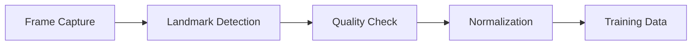

# Workout Posture Classifier 🏋️‍♂️

[](https://www.python.org/downloads/)
[](https://www.tensorflow.org/)
[](https://mediapipe.dev/)
[](LICENSE)

<div align="center">
  
  <p><i>Real-time workout pose detection and classification in action</i></p>
</div>

## 🎯 Overview

A sophisticated deep learning system that performs real-time workout posture classification using computer vision. The system leverages MediaPipe for precise pose detection and implements custom neural network architectures for accurate posture classification, providing immediate feedback on exercise form.

## ✨ Key Features

- 🎥 Real-time pose detection and classification
- 💪 Support for multiple workout poses/exercises
- 📊 Custom data collection pipeline for adding new exercises
- 🔄 Modular architecture with separate training and inference components
- 🖥️ Interactive UI with real-time feedback
- 🧠 Support for both Dense Neural Network and CNN models

## 🏗️ Technical Architecture

### 🔍 Components

1. **Pose Detection (MediaPipe)**

   - ⚡ Real-time body landmark detection
   - 🎯 33 key body points tracking
   - 🌟 Robust against varying lighting conditions and camera angles

2. **Neural Network Models**

   - 🔮 Dense Neural Network implementation
   - 🧠 CNN-based implementation for improved accuracy
   - ⚡ Custom model architecture optimized for real-time inference

3. **Data Pipeline**
   - 📥 Structured data collection process
   - 🔄 Automated preprocessing and normalization
   - ✅ Quality control system for landmark visibility
   - 📊 Coordinate normalization for consistency

## 📁 Project Structure

```
📦 workout-posture-classifier
 ┣ 📜 data_collection.py     # Data gathering pipeline
 ┣ 📜 data_training.py       # Dense NN training
 ┣ 📜 data_training_CNN.py   # CNN model training
 ┣ 📜 inference.py           # Real-time classification
 ┣ 📜 inference_cnn.py       # CNN-based inference
 ┣ 📜 ui_utils.py           # UI components
 ┗ 📜 model_comparison.py    # Analysis tools
```

## 🛠️ Requirements

```bash
pip install mediapipe    # Pose detection
pip install keras       # Neural network framework
pip install tensorflow  # Deep learning backend
pip install opencv-python # Computer vision
pip install numpy      # Numerical computations
```

## 🚀 Quick Start

### 📥 Installation

1. Clone the repository:
   ```bash
   git clone https://github.com/yourusername/workout-posture-classifier.git
   cd workout-posture-classifier
   ```
2. Install dependencies:
   ```bash
   pip install -r requirements.txt
   ```
3. Ensure your webcam is properly connected

### 💻 Usage Guide

#### 📸 Data Collection

```bash
python data_collection.py
```

1. Launch the interface
2. Enter exercise name
3. Follow on-screen instructions
4. Data is automatically processed

#### 🎯 Model Training

```bash
# For Dense Neural Network
python data_training.py

# For CNN model
python data_training_CNN.py
```

#### 🎮 Running Predictions

```bash
# Dense Neural Network inference
python inference.py

# CNN-based inference
python inference_cnn.py
```

## 🔬 Technical Details

### 🔄 Data Processing Pipeline



### 🧠 Model Architecture

- 📥 Input Layer: Normalized pose landmarks
- 🔄 Hidden Layers: ReLU activation
- 📤 Output Layer: Softmax classification
- 🎯 Regularization: Dropout layers

## 🤝 Contributing

We welcome contributions! Here's how you can help:

- 🐛 Report bugs and issues
- 💡 Propose new features
- 📝 Improve documentation
- 🔧 Submit pull requests

## 📄 License

This project is licensed under the MIT License - see the [LICENSE](LICENSE) file for details.

---

<div align="center">
  <b>Built with ❤️ for the fitness community</b>
</div>
